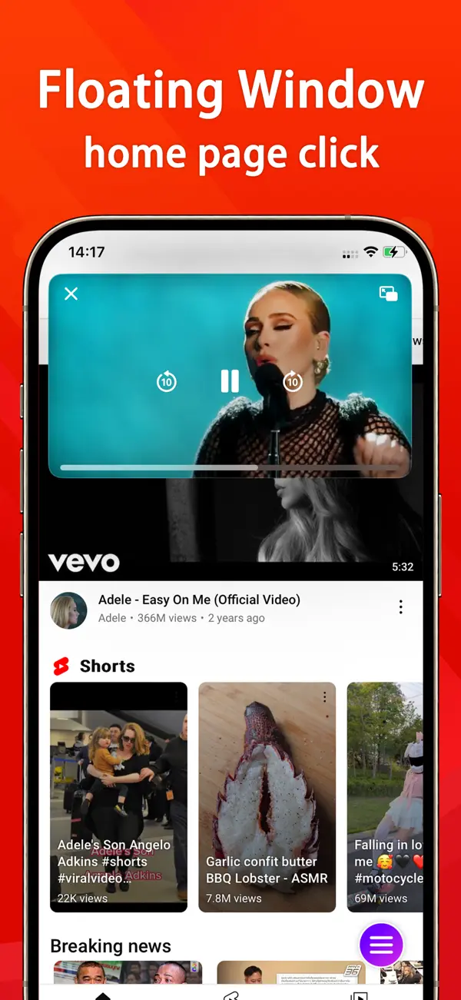
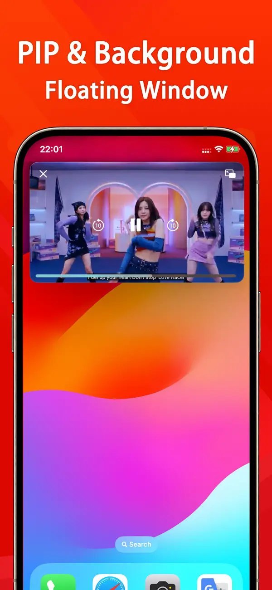
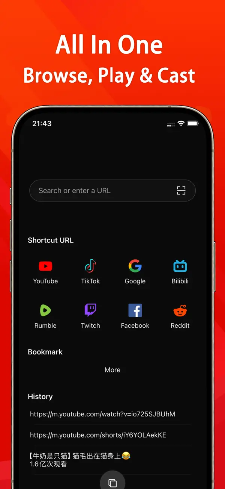

<html lang="en">
<head>
    <meta charset="utf-8">
    <meta http-equiv="X-UA-Compatible" content="IE=edge">
    <meta name="viewport" content="width=device-width, initial-scale=1.0, maximum-scale=1.0, user-scalable=no"/>
    <meta name="description" content="Float Tube is a very cool app that Lets you watch Tube Floating windows">
    <meta name="theme-color" content="#efeeff">
    <meta name="msapplication-navbutton-color" content="#efeeff">
    <meta name="apple-mobile-web-app-status-bar-style" content="#efeeff">
    <meta property="og:image" content="http://localhost:4000/assets/images/large-logo.png">
    <link rel="alternate" type="application/rss+xml" title="Float Tube" href="/feed.xml">
    <link href="https://fonts.googleapis.com/css?family=Heebo:900" rel="stylesheet">
    <title>Float Tube | Float Tube is a very cool app that Lets you watch Tube Floating windows</title>
    <meta name="generator" content="Jekyll v3.5.0"/>
    <meta property="og:title" content="Float Tube">
    <meta name="author" content="Ruffy">
    <meta property="og:locale" content="en_US"/>
    <meta name="description" content="Float Tube is a very cool app that Lets you watch Tube Floating windows"/>
    <meta property="og:description" content="Float Tube is a very cool app that Lets you watch Tube Floating windows"/>
    <link rel="canonical" href="http://localhost:4000/">
    <meta property="og:url" content="http://localhost:4000/">
    <meta property="og:site_name" content="Float Tube">
    <meta name="twitter:card" content="summary"/>
    <meta name="twitter:site" content="@"/>
    <meta name="twitter:creator" content="@Ruffy"/>
    
    <meta name="mobile-web-app-capable" content="yes">
    <meta name="theme-color" content="#fff">
    <meta name="application-name" content="mobile-app-landingpage-template">
    <link rel="apple-touch-icon" sizes="57x57" href="/assets/icons-297729cc8e943a64e9e7dbf11d0d81b0/apple-touch-icon-57x57.png">
    <!-- 此处省略其他 apple-touch-icon 的设置 -->
    <link rel="icon" type="image/png" sizes="32x32" href="/assets/icons-297729cc8e943a64e9e7dbf11d0d81b0/favicon-32x32.png">
    <!-- 此处省略其他 favicon 的设置 -->
    <link rel="shortcut icon" href="/assets/icons-297729cc8e943a64e9e7dbf11d0d81b0/favicon.ico">
    <link rel="apple-touch-startup-image" media="(device-width: 320px) and (device-height: 480px) and (-webkit-device-pixel-ratio: 1)" href="/assets/icons-297729cc8e943a64e9e7dbf11d0d81b0/apple-touch-startup-image-320x460.png">
    <!-- 此处省略其他 apple-touch-startup-image 的设置 -->
    <link href="/assets/app.css" rel="stylesheet">
</head>
<body>
<main>
    <header class="app__header container">
        

            
        

        

            <h1 class="app__name">Float Tube</h1>
            
A cool app that Lets you watch YouTube Floating windows

            

                
                
            
 
        

    </header>
    <section class="app__screenshots app__section">
        

            <h2 class="app__section-title">Screenshots</h2>
        

        

            

                
                
                
                
                <!-- 此处省略其他截图的设置 -->
            

        

    </section>
    <section class="app__fulldescription app__section container">
        <h2 class="app__section-title">Description</h2>
        

            
Float Tube is an app that can help you watch YouTube videos through Floating Window. With it, you can watch Tube videos while browsing the web and other things, completely free your phone. 
            	  
            	 With a lot of features: 
            	 - Floating Play tube video and music 
            	 - Free to used and you can limit ad playtimes 
            	 - Move and resize the floating window player 
            	 - Recommend your favorite videos based on playback history 
            	 - Well design to optimize your viewing experience
            

        

    </section>
    <section class="app__featured app__section container">
        <h2 class="app__section-title"></h2>
        

    </section>
</main>
<footer class="footer">
    

        

            <ul class="footer__links">
                <li class="footer__link">
                    <a href="https://pipyoutube.github.io/PrivacyPolicy.html" target="_blank">Privacy</a>
                </li>
                <li class="footer__link">
                    <a href="https://pipyoutube.github.io/EULA.html" target="_blank">EULA</a>
                </li>
            </ul>
        

    

</footer>

</body>
</html>
